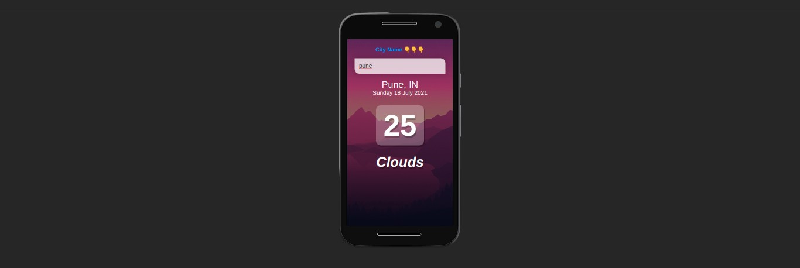
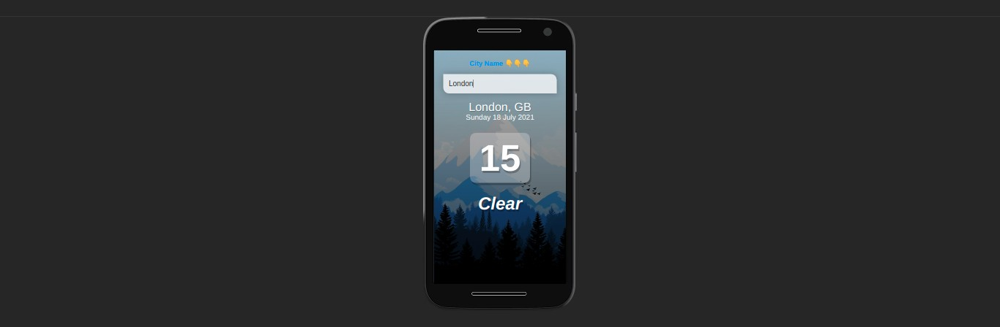

# <center>  weatherapp <center>

### - Use Tools
    - Vue Js
    - open Weather Map API

### - How to Use

- clone the Repo

```shell
git clone https://github.com/umagol/WeatherApp.git
```

- Install Packages

```shell
npm install
```

- Run Project
```shell
npm run serve
```
### - Screen Shot
<br/>

<br/>

